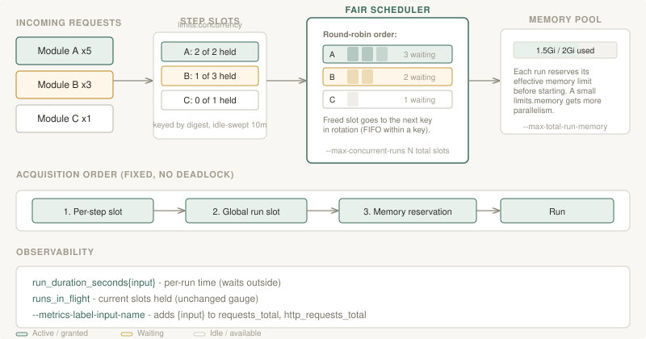

# Governance and Performance Additions

* Owner: Jonasz Małecki (@jonasz-lasut)
* Reviewers: Function WASM Maintainers
* Status: Implemented, revision 0.1

The resource-governance one-pager bounds a run by wall clock and linear
memory, the runtime by compiles, resident modules, disk and (optionally)
concurrent runs; the sandbox one-pager bounds egress per run. This
document adds what the 2026-08-16 capabilities research ranked as cheap and
worth having, in two phases: per-module egress rate limits, and fairness
inside one runtime (per-Input concurrency, fair queueing, a global
run-memory budget, an opt-in per-Input metric label). Each phase is a new
optional Input field or a new flag; none changes an existing one, and every
ceiling keeps the rule that the operator sets it and a Composition may only
ask for less. Nothing here gates `v0.1.0`.

Phases that were drafted and dropped: fuel-based instruction counting
(not portable to wazero), registry mirror / OCI layout / `function
precompile` (path mode covers air-gapped environments), and a raw-bytes
gRPC codec (maintenance cost outweighs the savings for typical XR sizes).

## Invariants across all phases

- **Ceilings are flags, budgets are Input fields, the Input only narrows.**
  A `limits` value above its ceiling is a fatal result naming both, as
  `runOptions` does today; a capability without its flag is
  `… is refused: the runtime was started without --enable-…`.
- **Digests are stated, not discovered.** Every fetch stays verified
  against the stated digest, and the caches keep their keys.
- **Metric cardinality stays bounded.** New label values are enumerations;
  the only identity label is the opt-in Input name, never a digest, ref
  or host.
- **The guest never sees a trap for a policy decision.** A cache miss, a
  rate limit or a slot wait is an error the guest reads or a fatal result
  the runtime issues — never a trap inside the module.

## ~~Phase 1 — Fuel~~ (dropped)

Wasmtime's fuel-based instruction counting (`SetConsumeFuel`, `SetFuel`,
`GetFuel`, `OutOfFuel` trap, codegen change requiring a separate compiled
cache namespace) is not portable to wazero, the stated fallback engine.
The project cannot build features tied to one wasm engine. The epoch
deadline (wall clock) remains the run bound.

## Phase 2 — Egress economy: per-module rate limits

A module called once per XR against the same endpoint makes one request per
reconcile per XR: a thousand XRs are a thousand identical GETs per sweep.
One addition in `internal/egress`, behind the operator's policy file:

**Per-module rate limits** (policy `rateLimit: {requestsPerMinute, burst}`).
A token bucket per module digest in `Egress` (a bounded, idle-expiring map:
the set of digests in use is the memory tier's size, not a metric label),
consulted in `Client.do` after the per-run `maxRequests` check; over the
limit the guest reads `sandbox.egress: the module's request rate exceeds
the egress policy's rateLimit` - `outcome=budget`, never a trap - and
retries next reconcile. Policy file only, like the other budgets; a
Composition cannot raise it. Idle entries are swept every ten minutes.
Deferred: a per-host bucket (protects a third party across modules - needs
a bounded key set first), a Composition-lowerable `sandbox.egress.rateLimit`.

Response caching was considered and dropped: the invalidation semantics
(TTL, Cache-Control, key correctness across headers) add complexity out of
proportion to the benefit when modules already run in milliseconds.

## Phase 3 - Fairness inside one runtime

`--max-concurrent-runs` is one FIFO: with it set, a slow module's requests
queue everyone's behind them (the resource-governance one-pager says so),
and without it `runs × --module-memory-limit` is the caller's number. Four
small additions, all in `internal/engine` and `cmd/function`, all optional:

- **`limits.concurrency`** (int32, ≥ 1): at most N runs of *this step* at
  once - a semaphore keyed by the module's content digest
  (bounded by the set of served digests, idle-expired every ten minutes),
  taken after the module is loaded and before the global slot, waited under
  the request context:
  `waiting for one of this step's 2 run slots (limits.concurrency): context
  deadline exceeded` - a fatal result that consumed nothing, not a run. No
  ceiling: a Composition can only lower; a value above
  `--max-concurrent-runs` is capped silently. **Implemented.**
- **Fair queueing** when `--max-concurrent-runs` is set: the slot channel
  becomes per-digest queues served round-robin (`engine.fairScheduler`), so
  one hot module takes at most its share of the slots and a request's wait
  is bounded by the number of *modules* waiting, not requests. Off the flag
  nothing changes. `RunOptions.Key` (the module digest) identifies the
  queue. M. **Implemented.**
- **`--max-total-run-memory`** (MB, `MAX_TOTAL_RUN_MEMORY`, 0 = off): a run
  reserves its effective memory limit (`limits.memory` or the ceiling) from
  a global pool before it starts and returns it after; a run that cannot fit
  waits under its context (`waiting for 512Mi of run memory
  (--max-total-run-memory 2Gi): context deadline exceeded`). Reservation,
  not accounting — the store limiter still caps actual use — so a step that
  states a small `limits.memory` gets more parallelism, an incentive to
  state it honestly. Acquisition order is fixed — per-Input slot, global
  slot, memory — so no cycle exists. S. **Implemented.**
- **`--metrics-label-input-name`** (bool, off): adds an `input` label - the
  Input's `metadata.name`, empty when unset - to `requests_total`,
  `run_duration_seconds`, `http_requests_total` and `run_instructions`. It
  is Composition-authored and bounded by the operator's own Compositions,
  never a digest, ref or host; the risk (hundreds of Inputs) is documented
  next to the flag. `internal/metrics` builds its vectors at startup with
  or without the label (`metrics.Init`). S. **Implemented.**

Interactions: the resource-governance table gains a row per addition;
`run_duration_seconds` keeps measuring runs (every wait is outside it);
`runs_in_flight` is unchanged.

## Trust and threats

Nothing here widens what a module can reach. The rate limit and fairness
only refuse or delay; the memory pool bounds total reservation. Threats to
test explicitly: a run holding a slot while it waits for memory (fixed
acquisition order, bounded by `ctx`).

## Phasing and effort

| phase | what | effort | lands |
|---|---|---|---|
| ~~1~~ | ~~fuel~~ | - | **Dropped** (not portable to wazero) |
| 2 | policy `rateLimit` | S | **Implemented.** |
| 3 | `limits.concurrency`, fair queueing, `--max-total-run-memory`, `--metrics-label-input-name` | S, M, S, S | **Implemented.** |
| ~~4~~ | ~~registry mirror, OCI layout, precompile~~ | - | **Dropped** (path mode covers air-gapped) |
| ~~5~~ | ~~raw-bytes codec~~ | - | **Dropped** (maintenance cost outweighs savings) |

Every phase is additive — new optional `limits`/`sandbox` fields, new
flags, new policy-file sections (a strict-parsed file with a new section
needs the runtime that knows it, a runtime concern, not an Input one), new
enumeration values on existing metric labels. Nothing here gates `v0.1.0`.

## Open questions

- ~~**Fuel as an engine-wide opt-in flag?**~~ Dropped: not portable to
  wazero.
- **Cache key: include the module digest?** Recommendation: yes — a hit rate
  across different modules against the same endpoint is not worth the
  sentence "modules never share responses" being conditional.
- **Rate-limit unit: per module digest or per host?** Recommendation: per
  module first (the digest is already the audit's unit and the key set is
  the memory tier's); per host when a bounded key set is designed.
- **Opt-in `input` metric label from `metadata.name`?** Recommendation:
  yes, off by default, the only identity label ever, documented with its
  cardinality risk; per-Input governance without per-Input observability is
  half a feature.
- **Warm-up from a bounded "last served" file on the cache volume?**
  Recommendation: no — it makes the warm set a function of history that a
  fresh volume lacks and an operator cannot read from the deployment;
  `--warm-modules` (stated) covers cold starts, and a persistent volume
  already keeps artifacts. Revisit if a real fleet shows the gap.
