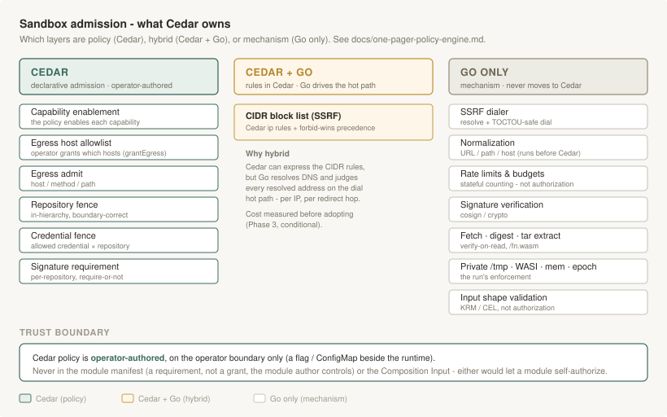
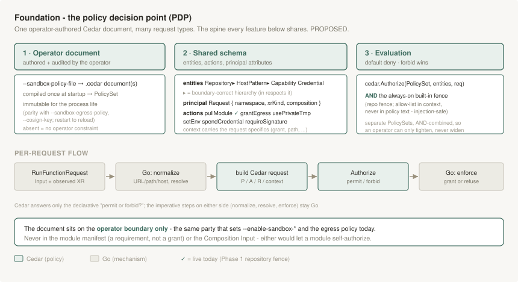
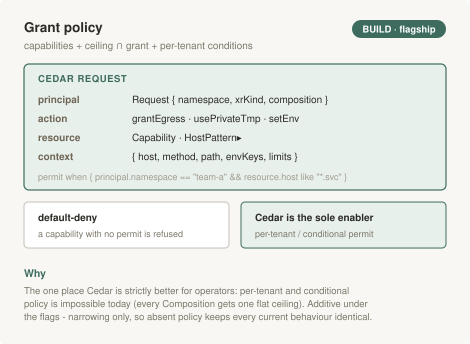
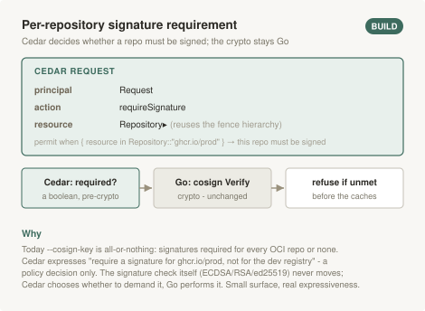
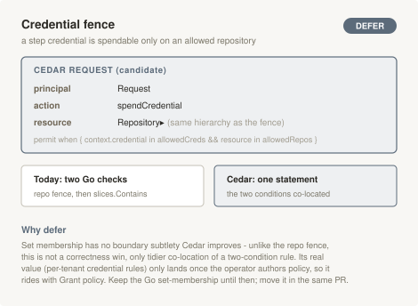
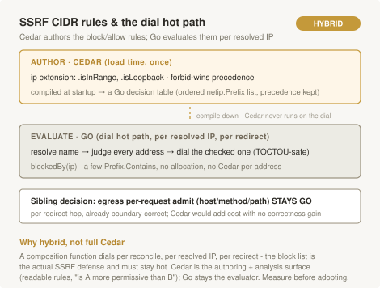

# Policy Engine (Cedar) Evaluation

* Owner: Jonasz Małecki (@jonasz-lasut)
* Reviewers: Function WASM Maintainers
* Status: Draft; Phase 1 (repository fence) implemented, Phase 2+ designed, revision 0.2

Whether to express function-wasm's sandbox admission decisions - egress rules,
the repository and credential fences, the ceiling that narrows a Composition's
grant - in [Cedar](https://www.cedarpolicy.com) (via the pure-Go
`cedar-policy/cedar-go`) instead of the hand-written Go in `internal/egress`,
`internal/sandbox` and `internal/module`. Written after a review surfaced a
run of small policy bugs (a repository-prefix boundary weakness among them) and
the question of whether the policy layer should become something operators
author rather than something the runtime hard-codes.

The short answer: Cedar is a **complement that can own the declarative
admission plane**, not a replacement for the sandbox. Its value is real only if
the goal is operator-authored policy; as an internal refactor it is a large
lever for a small problem, and the security-critical mechanism does not move to
it. This document maps exactly what can and cannot move, so the decision is made
on the boundary rather than on the appeal of a policy language.

## The dividing line: request-shaped decisions vs. mechanism

Cedar answers one kind of question: *given this principal, action, resource and
context, permit or forbid?* - stateless, over data already materialized.
Everything in the sandbox layer sorts into that bucket (**policy**) or into
**mechanism**: DNS resolution, the TOCTOU-safe dial, normalization,
cryptographic verification, stateful counting, and the WASI/memory/epoch
enforcement. Mechanism is not an authorization question and cannot become
Cedar. The whole decision rests on how much of the surface is policy.

## Layer map

| Decision surface | Today | Cedar-expressible | Notes |
|---|---|---|---|
| Which capabilities a Composition may grant (`--enable-sandbox-*`) | boolean flags | Yes | `permit(... action == Action::"grantEgress" ...)`; flags become policy |
| Ceiling narrows a grant (egress hosts/patterns, budgets caps) | `egress.Grant`, `sandbox.Ceiling.Grant` | Yes | The grant becomes the authorization *request*; the operator's policy decides. Models the two-party structure naturally |
| Egress request admit (host / method / path) | `egress.Grant.admit` | Yes, after normalization | `.like("*.example.com")`, method as action, path via `.like("/v1/*")` |
| Repository fence (XR-chosen ref) | `module.hasAnyPrefix` | Yes, and *better* | Model repos as an entity hierarchy: `resource in Repository::"ghcr.io/team"`. `in` respects the namespace boundary by construction - the prefix bug cannot recur |
| Credential fence | `module.admit` | Yes | `permit(... when { context.credential in allowed && resource in allowedRepos })` |
| Require a signature for repos matching X | `--cosign-key` (all-or-nothing) | Policy: yes | Cedar can decide *whether* to require a signature per-repo; the crypto stays Go. More expressive than today |
| CIDR block-list judgment (SSRF core) | `egress.blockedBy` on resolved IPs | Rules: yes / driving: no | Cedar's `ip` extension (`.isInRange`, `.isLoopback`) + `forbid`-wins models the rules and precedence, but resolution and the dial stay in Go and the authorizer runs **per resolved IP on the dial hot path** |
| Limits narrowing (timeout/mem/concurrency <= ceiling) | numeric `min` | Expressible, no gain | A one-line clamp; enforcement (epoch, limiter) is mechanism |
| Rate limits / budgets (maxRequests, bytes, token bucket) | `egress.ratelimit`, counters | No | Stateful counting over time; Cedar is stateless. Permanent Go |
| Signature verification (crypto) | `module.signature` | No | Mechanism |
| DNS resolve + TOCTOU-safe dial | `egress.dial` | No | Mechanism - the actual SSRF defense |
| URL/path/host normalization | `NormalizedPath`, `normalizeHost` | No | Must run *before* Cedar; an unnormalized path reintroduces the dot-segment bypass |
| Digest verify / fetch / tar extract / private /tmp / WASI+mem+epoch | resolver, engine | No | Mechanism |
| Input *shape* validation (host XOR hostPattern, enums) | `sandbox.Validate` + CRD/CEL | No (awkward) | KRM field-shape; stays in Go/CEL |

**Policy plane (top seven rows): a candidate for Cedar.** This is the surface an
operator would want to author, and it is scattered today across
`--enable-sandbox-*` flags, the `--sandbox-egress-policy` YAML and hand-coded
intersection logic. **Mechanism plane (the rest, roughly 60% of the surface):
imperative Go forever**, including the SSRF dialer, all stateful budgets, and
all crypto.

## Where Cedar is strictly better, not just equivalent

Two decisions gain correctness or expressiveness, not only a different syntax:

- **The repository/credential fence as an entity hierarchy.** Modeling a repo's
  namespace chain as Cedar entities and testing with `in` is boundary-correct by
  construction: `ghcr.io/team` cannot admit the sibling `ghcr.io/team-evil`, and
  `https://cdn.example.com` cannot admit the adjacent host
  `https://cdn.example.com.attacker.net`. This is the exact class of the bug the
  review found (now fixed in Go on `fix/sandbox-review-findings`); Cedar removes
  the footgun rather than re-encoding the string prefix.
- **Per-tenant and conditional operator policy.** `when { principal.namespace ==
  "team-a" }` and similar are natural in Cedar and impossible today - every
  Composition currently gets one flat ceiling. Add Cedar's schema validation of
  the policy itself and the Rust tooling's "is policy A more permissive than B"
  analysis, and the operator story is meaningfully richer than flags + a YAML
  file.

## Trust model: Cedar sits on the operator boundary only

This is a hard constraint, and it answers the "do we embed Cedar in the module
manifest?" question:

- **Not in the module manifest.** The manifest (`wasmfn.yaml`, the
  `application/vnd.wasmfn.manifest.v1+json` OCI layer) is authored by the module
  author and travels inside the artifact. The architecture's invariant
  (`docs/one-pager-module-manifest.md`) is that a manifest is a **requirement,
  never a grant**: `checkManifest` runs after admission and can only narrow.
  Cedar policy is a `permit`/`forbid` grant language. A module that could ship
  Cedar policy about itself would self-authorize - an attacker's module would
  ship a permissive policy - inverting the trust model. The manifest keeps
  declaring typed requirements (`Requires.Egress`, `Config.Schema`,
  `MinRuntime`); at most those become the entities/context the operator's policy
  evaluates.
- **Not in the Composition.** The Composition's `sandbox` block is authored by
  the Composition author (more trusted than the module, less than the operator)
  and stays a **request** that the operator's policy decides on. The Composition
  does not author `permit` either.
- **On the operator boundary.** The `permit`/`forbid` document lives with the
  runtime - a flag pointing at a file, or a ConfigMap - authored and audited by
  the operator, the same party who sets the `--enable-sandbox-*` flags and the
  egress policy today. Grants and requirements remain data the policy reads.

## Costs and risks

- **A new dependency.** `cedar-go` is pure Go (no CGo - fits the repo) and, as
  of this revision, is `v1.8.0` - past the pre-1.0 concern this doc first raised.
  Its footprint is lean: the only transitive dependency it adds is
  `golang.org/x/exp`. It joins the weekly Grype/supply-chain surface.
- **Hot-path evaluation.** A composition function runs per reconcile. Two costs
  need measuring, not assuming: per-request egress admit, and *per-resolved-IP*
  block-list evaluation on every dial. The current path is a few map lookups and
  string compares.
- **Two config models during migration**, and an operator adoption tax (learning
  Cedar). Worth it only if authorable policy is a goal users are asking for.
- **Mechanism is unchanged.** All the imperative Go that carries the actual
  security is still written and maintained; Cedar sits above it.

## Plan (phased, if approved)

De-risk the "is it worth it" question with the smallest slice that proves the
operator-authored-policy ergonomics, before touching any hot path:

1. **The repository fence** in a new `internal/authz` (Cedar) package that
   `internal/module` calls. Smallest surface, the decision where Cedar is
   strictly better, zero hot-path exposure (runs once per resolve, not per
   request). **Done** (`internal/authz`): the fence is a static Cedar policy
   (`resource in context.allowedRepositories`) over a boundary-correct
   repository entity hierarchy - a location's ancestors are its path-boundary
   prefixes, both slash forms - behind the module package's existing refusal
   strings. The allow list travels in the request context, never the policy
   text, so a Composition-authored entry cannot inject policy. The credential
   check stays exact set membership (no boundary subtlety Cedar would improve).
2. **Measure and decide.** If the slice feels good, egress admit is the next
   candidate and there are real numbers; if not, one package was spent, not a
   rewrite.
3. **Egress admit (conditional on step 2)**, with the normalization staying in
   Go and a benchmark of admit + per-IP block-list evaluation on the dial path.
4. The SSRF dialer, the budgets/rate-limits, the crypto, and the Input shape
   validation never move.

## Phase 2+ feature designs

With Phase 1 landed, this maps the remaining policy plane (the top rows of the
layer map) into concrete, buildable features, each with a verdict, before any of
them becomes in-tree code. Every one is grounded in the surface it would replace
(`internal/admission`, `internal/egress`, `internal/sandbox`, `internal/module`).

### The policy decision point (foundation)

One operator-authored Cedar document (`--policy-file`), compiled once at startup
and immutable for the process, deliberate parity with `--sandbox-egress-policy`
and `--cosign-key` (restart to reload; hot-reload is a later option, not a
launch requirement). Absent, the operator adds no constraint and every current
behaviour is identical.

- **Principal** is `Request { namespace, xrKind, composition }` - the only caller
  identity the function actually has, drawn from the observed XR and the pipeline
  step context of the `RunFunctionRequest`. Per-tenant policy has to key on
  something real; this is it.
- **Entities** are `Repository` and `HostPattern` (the boundary-correct
  hierarchies, `in` respects the boundary), `Capability` and `Credential`.
  **Actions** are `pullModule` (live), `grantEgress`, `usePrivateTmp`, `setEnv`,
  `spendCredential`, `requireSignature`.
- **Evaluation** is default-deny, `forbid` wins. The always-on built-in fence
  (the Composition's allow list in context, injection-safe) and the operator
  document are **separate PolicySets, AND-combined**, so an operator document can
  only tighten, never widen the fence.

Cedar answers only "permit or forbid?"; the imperative steps on either side
(normalize, resolve, enforce) stay Go.

### Grant policy - build, the flagship

Capability enablement (`--enable-sandbox-*`), the ceiling intersection
(`sandbox.Ceiling.Grant`, `egress.Egress.Grant`) and limits collapse into one
two-party model: the Composition's `sandbox`/`limits` block becomes the
authorization *request*, the operator's policy decides. This is the one surface
where Cedar is strictly *better*, not just different syntax - per-tenant and
conditional policy (`when { principal.namespace == "team-a" }`) is impossible
today, where every Composition gets one flat ceiling.

**The `--enable-sandbox-*` flags stay as the hard floor.** A capability a flag
disables is never grantable, whatever the policy says; Cedar narrows *within* an
enabled capability, never past it. The flags are retained for defense in depth (a
policy misconfiguration cannot widen a capability), auditability (a boolean in a
`DeploymentRuntimeConfig` is legible at a glance), and additivity (no policy file
means today's behaviour).

**The `--sandbox-egress-policy` file, by contrast, is meant to end up as Cedar.**
Its declarative parts are exactly what Cedar expresses: the host/pattern ceiling
(this feature, `grantEgress`) and the CIDR block/allow rules (the SSRF feature
below) map directly onto the operator's document, so the standalone YAML
dissolves once both land - one document, authored and analysable in one language,
instead of a bespoke schema. Only its budgets and rate limit stay behind as
numeric config: they are stateful counting over time, which Cedar cannot express
(see the SSRF and non-goals sections). The migration is gated by the spike, but
the destination is not in doubt - the egress policy file was always a
policy-shaped thing wearing a YAML costume.

### Per-repository signature requirement - build

Today `--cosign-key` is all-or-nothing. Cedar decides *whether* a given repo must
be signed (a boolean, pre-crypto, reusing the `Repository` hierarchy); the cosign
verification in `module.Verifier` does not move. Small surface, real
expressiveness, independent of the rest.

### Credential fence - defer, rides with grant policy

Cedar-expressible (`spendCredential when { context.credential in allowedCreds &&
resource in allowedRepos }`, co-locating the two checks now split across
`module.admit`), but it is set membership with no boundary subtlety Cedar
improves - unlike the repository fence, no correctness win. Its value (per-tenant
credential rules) only lands once the operator authors policy, so it rides in the
grant-policy work rather than leading. Keep the Go set-membership until then.

### SSRF CIDR rules - hybrid, Cedar-authored / Go-evaluated

Cedar's `ip` extension (`.isInRange`, `.isLoopback`, `forbid`-wins) is a good
*authoring and analysis* surface for the block/allow rules - but `egress.blockedBy`
runs per resolved IP, per redirect hop, per reconcile and is the actual SSRF
defense. So the rules compile to a Go decision table at load and **Cedar never
runs on the dial path**. Its sibling, egress per-request admit (host/method/path),
**stays fully Go** for the same reason: already boundary-correct, hot, nothing to
gain. The operator-authored part of egress - the *ceiling* (may this Composition
grant this host) - is feature "Grant policy" above, evaluated once at admission,
not per hop.

### Verdicts and sequencing

| Feature | Verdict | Why |
|---|---|---|
| Grant policy (capabilities + ceiling + per-tenant) | **Build** - flagship | The only strictly-better surface; additive under the flags |
| Per-repo signature requirement | **Build** | Per-repo beats all-or-nothing `--cosign-key`; crypto unchanged |
| Credential fence | **Defer** | No correctness gain; rides with grant policy |
| SSRF CIDR rules | **Hybrid** | Cedar authors, a Go table evaluates on the hot path |
| Egress per-request admit | **Stays Go** | Hot, per-redirect, already boundary-correct |

Sequencing keeps the plan's gate at every step:

1. **Foundation + grant policy** (fold in the credential fence, which shares the
   repository hierarchy). Proves operator-authored-policy ergonomics at the cheap
   end - admission-time, no hot loop. One package spent if it feels wrong.
2. **Measure**, then decide on egress/SSRF.
3. **Per-repo signature** - small, independent, can land any time after the
   foundation.
4. **SSRF CIDR** only behind a benchmark. Egress per-request admit never moves.

Once the host/pattern ceiling (step 1) and the CIDR rules (step 4) are both in
Cedar, the `--sandbox-egress-policy` YAML retires to a budgets-only config: the
declarative half becomes policy, the stateful half stays numeric.

## Non-goals

- Dropping the `--enable-sandbox-*` flags. They remain the hard floor the operator
  policy narrows within, not a thing Cedar replaces (see grant policy above).
- Replacing the SSRF dialer, the budgets, the rate limiter, the signature
  verifier, or the digest/fetch/tar mechanism with Cedar.
- Cedar policy in the module manifest or the Composition Input (trust-model
  inversion; see above).
- A big-bang migration of the whole policy layer. The phased spike gates every
  step.
- Changing the operator's flags or the egress policy file before a spike proves
  the Cedar model; the current knobs stay until then.

## Alternatives considered

- **Keep the custom Go (do nothing).** The policy code is well-tested and, with
  the review fixes landed, correct. This is the right choice if operator-authored
  policy is not a goal - the maintenance pain was rough edges, not an unsound
  architecture.
- **OPA / Rego.** A more mature engine with a Go host, but a larger dependency
  and a general-purpose language where Cedar's authorization-specific model
  (entities, `in`, `forbid`-wins, schema, analysis) fits this problem more
  tightly and is the better match for the fence hierarchy.
- **Fix the bugs, express nothing in a policy engine.** Done for the immediate
  security bug; this one-pager exists because the *longer-term* operator-authored
  direction is a separate, deliberate call.

## Open questions

- Is operator-authored, auditable policy a goal real users are asking for, or is
  the motivation internal tidiness? The answer decides whether to proceed past
  the spike.
- ~~`cedar-go`'s 1.0 status~~ - resolved: `v1.8.0` is in use. Semantics parity
  with the Rust engine for the features beyond the fence (the `ip` extension,
  `.like`) still to confirm when egress admit is considered.
- Measured per-request and per-dial evaluation cost against the current path.
- ~~Where the operator's Cedar document lives and how it reloads~~ - designed
  (Phase 2+, foundation): a `--policy-file` read at startup and immutable for the
  process, parity with `--sandbox-egress-policy`; a mounted ConfigMap satisfies
  the flag, and restart reloads. Hot-reload stays a later option.

## References

- `docs/one-pager-sandbox.md` - the grants and the egress ceiling this would
  express
- `docs/one-pager-trust-model.md` - the parties and why policy is operator-only
- `docs/one-pager-module-manifest.md` - requirement-not-grant, why Cedar stays
  out of the artifact
- `docs/one-pager-module-source-schema.md` - `policy` (the repository/credential
  fence)
- Cedar: https://www.cedarpolicy.com , `cedar-policy/cedar-go`
